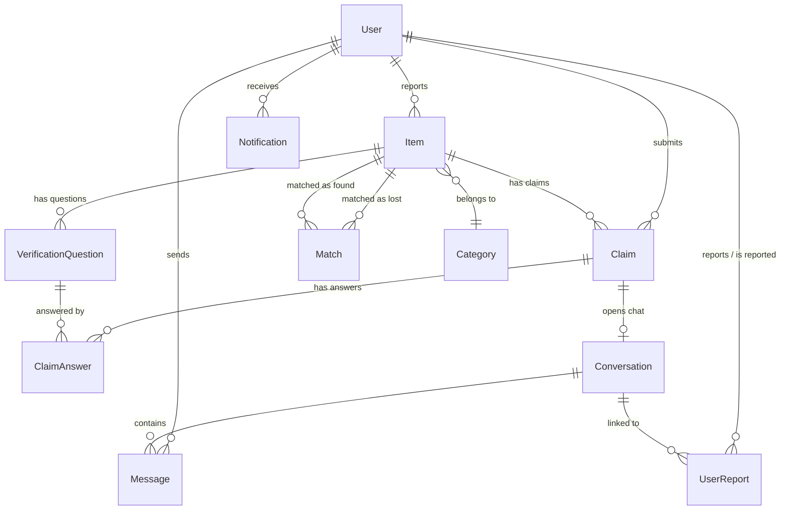

<div align="center">

# Trace 🔎

**A secure, full-stack campus lost‑and‑found platform built for the university community.**

Report lost items. Claim found ones. Get matched automatically.<br/>
Chat securely. Reunite with your stuff.

<br/>

[](https://nodejs.org/)
[](https://react.dev/)
[](https://www.typescriptlang.org/)
[](https://www.prisma.io/)
[](https://supabase.com/)
[](https://socket.io/)

<br/>

[Features](#-features) · [Tech Stack](#-tech-stack) · [Getting Started](#-getting-started) · [API](#-api-overview) · [Database](#-database-schema)

</div>

<br/>

## ✨ Features

### 📋 Core Platform
- **Report Lost & Found Items** — Multi-image uploads, categories, brand, color, location, date, and custom tags
- **Browse & Search** — Filter by type (lost/found), category, status, and keywords with paginated results
- **Edit & Manage Reports** — Full CRUD on your own reports

### 🤖 Smart Matching Engine
- **Automatic Matching** — Heuristic scoring (0–100%) cross-referencing brand, color, location, keyword overlap, and timeline plausibility
- **Confidence Scores** — Each match includes a breakdown (e.g. *"Brand matches"*, *"2 keyword(s) matched"*, *"Timeline aligns"*)
- **Impossible Match Rejection** — Filters out items found *before* they were lost (24h grace window)

### ✅ Verification & Claims
- **Verification Questions** — Finders set secret questions; claimants must answer all before submitting
- **Proof Submission** — Written descriptions + optional proof images
- **Dual Claim Workflows:**
  - **Found items** → approve/reject with verification questions; approval auto-resolves and rejects competing claims
  - **Lost items** → instant auto-approval opens a secure chat immediately; multiple finders can help simultaneously
- **Re-Claim Support** — Rejected claimants can resubmit with better proof

### 💬 Real-Time Communication
- **Secure Chat** — 1-on-1 conversations via Socket.io between reporters and approved claimants
- **Server-Side Authorization** — Every message validated against conversation membership; receiver derived server-side
- **Per-User Chat Deletion** — Delete a thread from your inbox without affecting the other party
- **Message Limits** — 5,000-character cap enforced server-side

### 🔔 Notifications
- **Real-Time Push** — Instant Socket.io notifications for matches, claims, approvals, rejections, and moderation
- **Email Alerts** — Transactional emails via Gmail SMTP for match discoveries, claim approvals, and new claims
- **Read/Unread Management** — Mark individual or all notifications as read

### 🛡️ Admin & Moderation
- **Admin Dashboard** — Platform stats at a glance (users, active items, resolved items, matches)
- **User Management** — Search, ban/unban, per-user item/claim counts
- **Item Moderation** — Soft-delete, restore, or hard-delete any item
- **User Reporting** — Report chat abuse, scams, inappropriate behavior; linked to specific conversations
- **Report Review** — Pending → reviewed → dismissed pipeline

### 🔐 Authentication & Security
- **JWT via HTTP-Only Cookies** — Tokens never exposed to JavaScript; XSS-safe
- **Email OTP Verification** — 6-digit code, 10-min expiry, resend, brute-force lockout after 5 attempts
- **Deep Email Validation** — MX records, disposable email blocking, typo detection
- **Rate Limiting** — 500 req/15 min global + stricter auth-route limits
- **Helmet** — Security headers out of the box
- **Zod Validation** — Every request body validated; Multer for safe file uploads
- **Role-Based Access** — `STUDENT` / `ADMIN` roles with guards on client and server
- **Soft Deletes** — Reversible user and item deletions

### 🎨 User Experience
- **Dark Mode** — System-aware with manual toggle
- **Code Splitting** — `React.lazy()` + `Suspense` for fast initial loads
- **Framer Motion** — Smooth transitions and micro-animations
- **Responsive** — Tailwind CSS v4, mobile-first
- **Charts** — Dashboard visualizations with Recharts
- **Error Boundary** — Graceful global crash recovery
- **Smart Caching** — TanStack Query with 30s stale time, conditional retry, background refetch

<br/>

## 🏗️ Tech Stack

<table>
  <tr>
    <td><b>Frontend</b></td>
    <td>React 19 · Vite 8 · TypeScript · Tailwind CSS 4 · React Router 7 · TanStack Query 5</td>
  </tr>
  <tr>
    <td><b>UI</b></td>
    <td>Framer Motion · Recharts · Lucide React · React DatePicker</td>
  </tr>
  <tr>
    <td><b>Backend</b></td>
    <td>Node.js · Express 4 · TypeScript</td>
  </tr>
  <tr>
    <td><b>Database</b></td>
    <td>PostgreSQL (Supabase) · Prisma 5 ORM</td>
  </tr>
  <tr>
    <td><b>Auth</b></td>
    <td>JWT (HTTP-only cookies) · Email OTP · bcryptjs</td>
  </tr>
  <tr>
    <td><b>Real-Time</b></td>
    <td>Socket.io 4</td>
  </tr>
  <tr>
    <td><b>Storage</b></td>
    <td>ImageKit (via Multer)</td>
  </tr>
  <tr>
    <td><b>Email</b></td>
    <td>Nodemailer (Gmail SMTP)</td>
  </tr>
  <tr>
    <td><b>Security</b></td>
    <td>Helmet · express-rate-limit · Zod · deep-email-validator</td>
  </tr>
  <tr>
    <td><b>Tooling</b></td>
    <td>oxlint · ts-node-dev</td>
  </tr>
  <tr>
    <td><b>Deploy</b></td>
    <td>Vercel (client) · Render (server)</td>
  </tr>
</table>

<br/>

## 📁 Project Structure

```
Trace/
├── client/                      # React + Vite frontend
│   └── src/
│       ├── api/                 # Axios API layer (auth, items, claims, chat, admin, …)
│       ├── components/          # Reusable UI (admin, chat, claims, layout, notifications)
│       ├── context/             # AuthContext · ThemeContext
│       ├── hooks/               # useNotifications · useModalAnimation
│       ├── pages/
│       │   ├── Landing.tsx      # Public landing page
│       │   ├── auth/            # Login · Register (with OTP)
│       │   ├── dashboard/       # Dashboard · MyReports · MyClaims
│       │   ├── items/           # BrowseItems · ItemDetail · ReportItem · EditItem
│       │   ├── chat/            # Messages (real-time)
│       │   ├── admin/           # AdminDashboard
│       │   └── legal/           # PrivacyPolicy · TermsOfService · Security
│       ├── routes/              # AppRouter (lazy) · ProtectedRoute guards
│       └── types/               # Shared TypeScript types
│
└── server/                      # Express + TypeScript backend
    ├── prisma/
    │   ├── schema.prisma        # 12 models · 6 enums · optimized indexes
    │   └── seed.ts              # Database seeding
    └── src/
        ├── config/              # Environment · Prisma client
        ├── controllers/         # Route handlers
        ├── middlewares/         # authenticate · requireRole · validate · errorHandler
        ├── routes/              # Express routers with per-route rate limiting
        ├── services/            # Business logic (auth, item, claim, match, notification, admin)
        ├── utils/               # AppError · JWT · ImageKit · Mailer
        └── validators/          # Zod schemas
```

<br/>

## 🚀 Getting Started

### Prerequisites

| Requirement | Notes |
|---|---|
| **Node.js** v18+ | Runtime |
| **PostgreSQL** | [Supabase](https://supabase.com/) recommended |
| **ImageKit** | Image uploads — [imagekit.io](https://imagekit.io/) |
| **Gmail App Password** | Email delivery — [create one here](https://myaccount.google.com/apppasswords) *(optional — omit to log emails to console)* |

### Setup

```bash
# 1. Clone
git clone https://github.com/vikram-singh05/Trace.git
cd Trace

# 2. Environment variables
cp .env.example .env
# Fill in values in /client/.env and /server/.env
# See .env.example for full documentation

# 3. Backend
cd server
npm install
npx prisma migrate dev        # Apply migrations
npx prisma db seed             # (Optional) Seed sample data
npm run dev                    # → http://localhost:5000

# 4. Frontend (new terminal)
cd client
npm install
npm run dev                    # → http://localhost:5173
```

<details>
<summary><b>📋 All Available Commands</b></summary>

<br/>

| Command | Description |
|---|---|
| `npm run dev` | Start dev server (client or server) |
| `npm run build` | Production build |
| `npm run lint` | Run oxlint (client) |
| `npx prisma studio` | Visual database browser |
| `npx prisma migrate dev` | Apply pending migrations |
| `npx prisma db seed` | Run the seed script |
| `npx prisma generate` | Regenerate Prisma client |

</details>

<br/>

## 🔌 API Overview

All endpoints are prefixed with `/api/v1`. Auth is via HTTP-only cookie (`token`).

| Route | Description |
|---|---|
| `POST /auth/register` | Register + send OTP |
| `POST /auth/verify-otp` | Verify email |
| `POST /auth/login` | Login + set cookie |
| `GET  /auth/me` | Current user profile |
| `GET  /items` | Browse with filters & pagination |
| `POST /items` | Create lost/found report |
| `GET  /items/:id` | Item detail + matches |
| `PUT  /items/:id` | Edit item |
| `POST /claims` | Submit claim with proof |
| `PATCH /claims/:id` | Approve / reject |
| `GET  /chat` | List conversations |
| `GET  /notifications` | List notifications |
| `GET  /admin/stats` | Dashboard statistics |
| `GET  /admin/users` | User management |
| `POST /reports` | Report a user |
| `POST /upload/auth` | ImageKit upload auth |
| `GET  /health` | Health check *(no rate limit)* |

<br/>

## 📊 Database Schema

12 models across 5 domains:



| Domain | Models |
|---|---|
| **Users** | `User` *(OTP, soft delete, ban)* |
| **Items** | `Item` · `Category` · `VerificationQuestion` · `Match` |
| **Claims** | `Claim` · `ClaimAnswer` |
| **Communication** | `Conversation` · `Message` · `Notification` |
| **Moderation** | `UserReport` |

<br/>

## 🛡️ Security

| Layer | Implementation |
|---|---|
| **Passwords** | bcrypt (12 rounds) |
| **Session** | JWT in HTTP-only, secure, same-site cookies |
| **Registration** | Email OTP + MX validation + disposable email blocking |
| **Brute-Force** | OTP lockout after 5 attempts |
| **Rate Limiting** | Global (500/15 min) + strict auth-route limits |
| **Headers** | Helmet |
| **Validation** | Zod schemas on every endpoint |
| **CORS** | Locked to configured client origin |
| **Data** | Soft deletes — nothing is permanently lost |
| **Chat** | Server-side authorization prevents message injection |

<br/>

## 🤝 Contributing

1. Fork the repository
2. Create your feature branch (`git checkout -b feature/amazing-feature`)
3. Commit your changes (`git commit -m 'Add amazing feature'`)
4. Push to the branch (`git push origin feature/amazing-feature`)
5. Open a Pull Request

<br/>

## 📄 License

This project is for educational and portfolio purposes.

---

<div align="center">
  <sub>Built with ☕ and persistence by <a href="https://github.com/vikram-singh05">Vikram Singh</a></sub>
</div>
